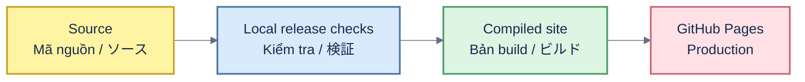

# BizRoll — production artifact

[English](#english) · [Tiếng Việt](#tiếng-việt) · [日本語](#日本語)

## English

This public repository contains only the compiled BizRoll website served at [thangldw.github.io/bizroll](https://thangldw.github.io/bizroll/). The authoritative source, tests and release process live in [thangldw/bizroll-game](https://github.com/thangldw/bizroll-game). Do not edit generated assets here by hand.

## Tiếng Việt

Repo public này chỉ chứa website BizRoll đã biên dịch và được phục vụ tại [thangldw.github.io/bizroll](https://thangldw.github.io/bizroll/). Mã nguồn chuẩn, test và quy trình phát hành nằm tại [thangldw/bizroll-game](https://github.com/thangldw/bizroll-game). Không sửa thủ công các asset đã build trong repo này.

## 日本語

この公開リポジトリには、[thangldw.github.io/bizroll](https://thangldw.github.io/bizroll/) で配信する BizRoll のビルド済みサイトのみを保存します。正規のソース、テスト、リリース手順は [thangldw/bizroll-game](https://github.com/thangldw/bizroll-game) にあります。生成済みアセットを手作業で編集しないでください。
